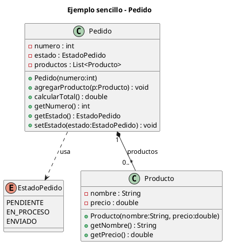

# UML - PRÁCTICA 1 – Introducción a UML y POO

**Ejemplo: Pedido y Producto**

## 1. Objetivo de la práctica

El objetivo de esta práctica es:

* Iniciarse en la **lectura e interpretación de diagramas de clases UML**
* Relacionar **UML con código Java**
* Comprender el uso de **tipos enumerados (`enum`)**
* Investigar de forma autónoma los **símbolos básicos de UML**

---

## 2. Diagrama de clases (UML)

A continuación se muestra el **diagrama UML** del sistema que vamos a utilizar.

### 👉 Instrucciones

1. Copia el siguiente código.
2. Pégalo en un visor de **PlantUML**.
3. Observa con atención los símbolos que aparecen en el diagrama (cajas, líneas, rombos, multiplicidades, flechas, etc.).



---

## 3. Relación entre las clases Pedido y Producto (requerimiento del sistema)

El sistema debe cumplir el siguiente **requerimiento funcional**:

> Un **pedido** está formado por cero o varios **productos**, y el pedido debe poder calcular el importe total a partir de los precios de esos productos.

A partir del diagrama UML, se observa que:

* Existe una **relación** entre las clases `Pedido` y `Producto`.
* Un pedido puede estar relacionado con **varios productos**.
* Cada producto pertenece a **un único pedido** dentro del sistema.

⚠️ **No se indica explícitamente el tipo de relación**, ya que forma parte del trabajo de análisis e investigación que se realizará posteriormente en clase.

---

## 4. Trabajo a realizar en el programa principal (`Main`)

Una vez analizado el diagrama y creadas las clases en Java, en el método `main` se debe hacer lo siguiente:

1. Crear un **pedido** con número `1`.
2. Crear **dos productos**, por ejemplo:

   * Teclado (25.50 €)
   * Ratón (15.00 €)
3. Añadir los productos al pedido.
4. Mostrar por pantalla:

   * el número del pedido
   * el estado actual del pedido
   * el total del pedido
5. Cambiar el estado del pedido a **ENVIADO**.
6. Mostrar de nuevo el estado del pedido tras el cambio.

👉 **No se pide menú ni entrada por teclado**.

---

## 5. ¿Qué es un tipo de dato ENUMERADO?

Un **tipo enumerado** (en Java, `enum`) es un tipo de dato especial que permite definir un **conjunto cerrado de valores posibles**.

Se utiliza cuando una variable **solo puede tomar ciertos valores concretos**, y ningún otro.

### Ejemplo sencillo

```java
public enum DiaSemana {
    LUNES,
    MARTES,
    MIERCOLES,
    JUEVES,
    VIERNES
}
```

Uso:

```java
DiaSemana dia = DiaSemana.LUNES;
```

Esto significa que la variable `dia`:

* solo puede valer uno de los valores definidos
* no puede tomar valores arbitrarios

---

## 6. Cuestiones de análisis (para investigar)

Responde razonadamente a las siguientes preguntas:

1. ¿Qué **tipo de relación** se define en el diagrama UML entre `Pedido` y `Producto`?
2. ¿Qué significa la **cardinalidad** indicada en esa relación?
3. ¿Qué otros tipos de **cardinalidad** se pueden definir en UML?

   * Investiga y explica al menos tres ejemplos distintos.
4. ¿Qué diferencias existen entre una **asociación**, una **agregación** y una **composición**?

   * No es necesario profundizar, solo una explicación básica.

Estas cuestiones se comentarán y resolverán **en clase**, a partir de los diagramas realizados.

---

## 7. Entrega

Se deberá entregar:

* El código Java de las clases (`Pedido`, `Producto`, `EstadoPedido`)
* El programa principal (`Main`)
* El **diagrama UML exportado en formato imagen (PNG)** a partir de PlantUML
* Un breve documento (o comentario en el propio código) respondiendo a las **cuestiones de análisis**

📌 *El diagrama UML puede entregarse como imagen PNG exportada desde PlantUML.*

---

## Nota para el alumnado

Esta práctica no consiste solo en programar, sino en **aprender a interpretar un diagrama UML** y comprender cómo se traduce a código Java.

---

* prepararte una **solución modelo comentada** (solo para ti),
* o una **guía de corrección** muy sencilla centrada en interpretación UML y no tanto en el código.
